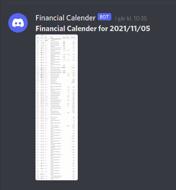
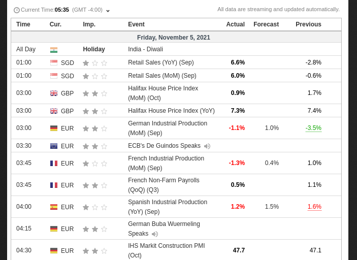

# mm-calendar

## How to use

First make sure you've got the firefox browser and geckodriver:
1. Download firefox through whatever packagemanager you're using
1. Download the geckodriver (current latest found [here](https://github.com/mozilla/geckodriver/releases/download/v0.30.0/geckodriver-v0.30.0-linux64.tar.gz)) and place in PATH:
```bash
wget https://github.com/mozilla/geckodriver/releases/download/v0.30.0/geckodriver-v0.30.0-linux64.tar.gz
tar xvf geckodriver-v0.30.0-linux64.tar.gz
rm geckodriver-v0.30.0-linux64.tar.gz
sudo mv geckodriver /usr/bin
```
Then clone the repo, make required changes and start/enable the systemd timer:
1. Clone the repo
1. Alter the `mm-calendar.service` & `mm-calendar.timer` and replace values in `{{ }}` with the right paths, username etc. Optionally alter the time of trigger
1. Enter your `HOOK_ID` and `HOOK_SECRET` in `mm-calendar.py`
1. Move the service and timer to `/etc/systemd/system/`
1. Start and enable the timer:
```bash
sudo systemctl start mm-calendar.timer
sudo systemctl enable mm-calendar.timer
```
## Example

The Financial Calender will be posted through the webhook daily on weekdays:


The resolution is large enough to view when zoomed:
